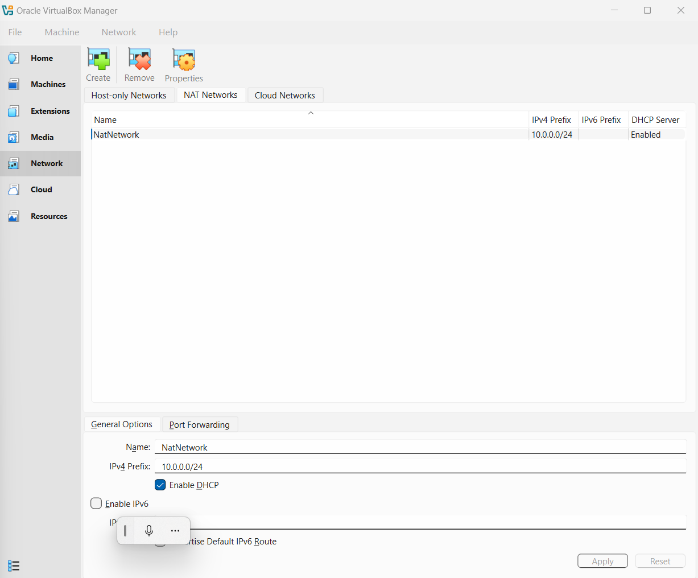
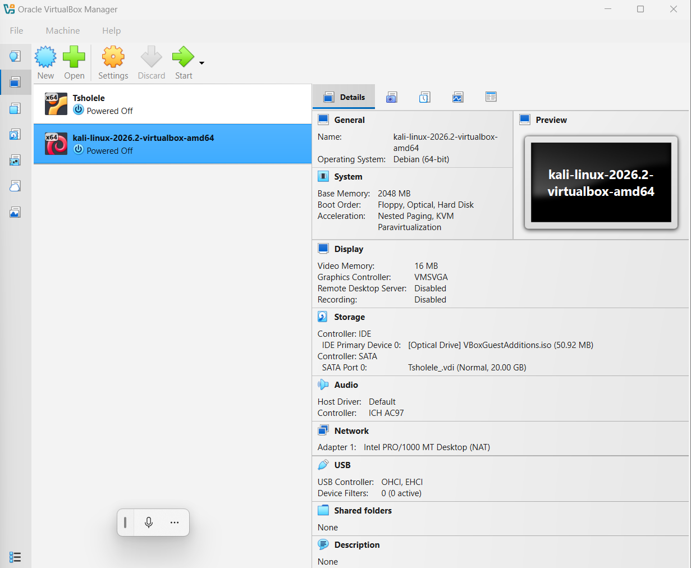
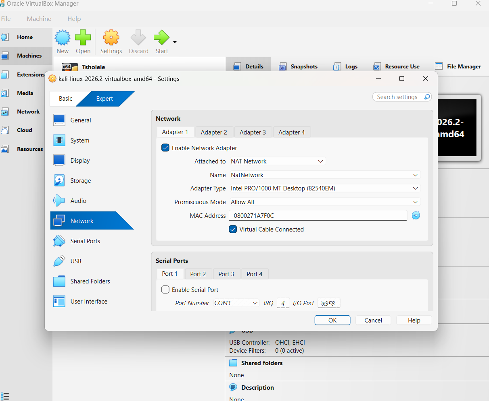
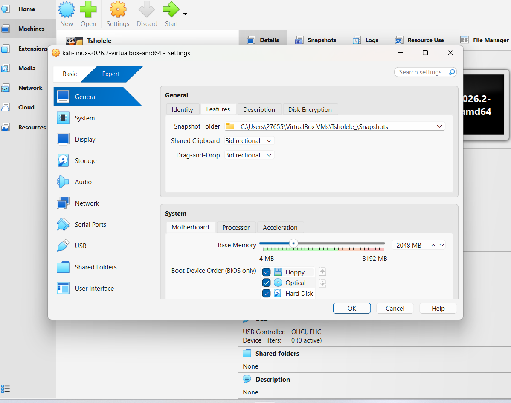
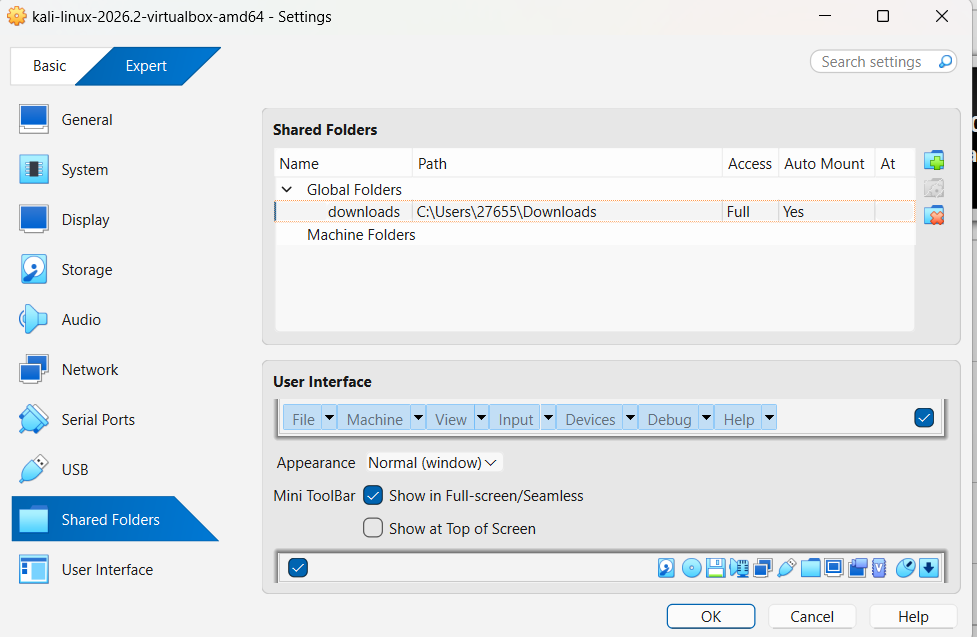
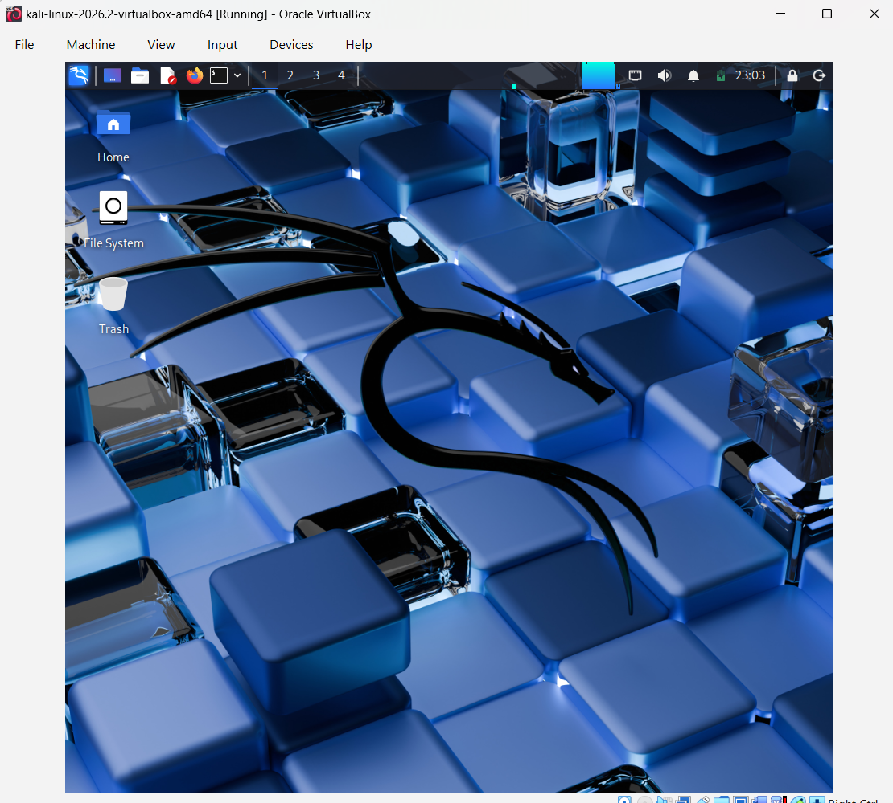
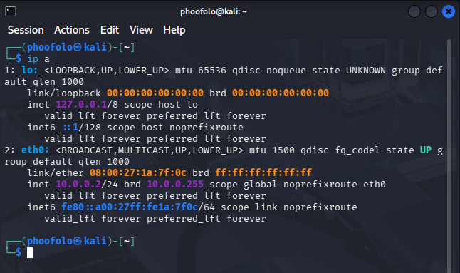
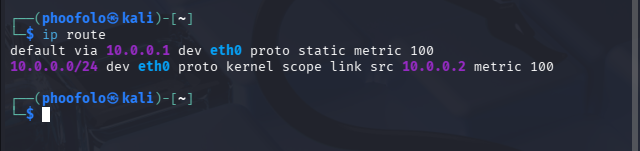
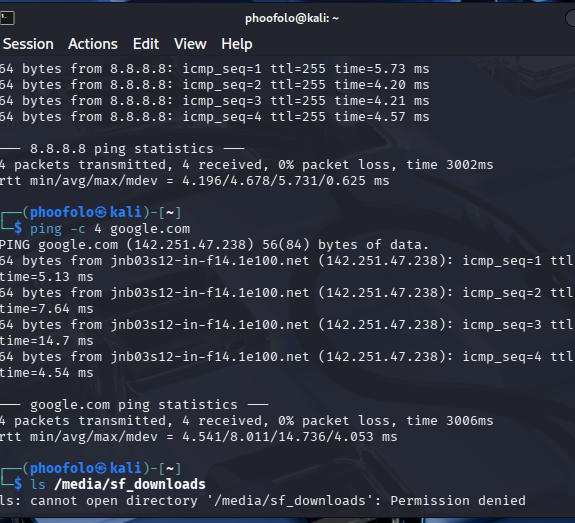

markdown
# NETWORKWALKS Cybersecurity Internship - Batch B083

## Week 1 - Project Module 1 - Cybersecurity & Pentesting Lab Setup

**Building an isolated virtual lab for penetration testing and ethical hacking practice**

---

**Intern:** Tsholele  
**Batch:** B083  
**Week:** 1  
**Project:** PM1 - Cybersecurity Lab Setup  
**Date:** September 2026

---

## Project Overview

This project sets up a **virtual cybersecurity and penetration-testing laboratory** using VirtualBox and Kali Linux.

The lab provides a controlled environment where cybersecurity tools, network scanning, reconnaissance, vulnerability assessment, and other security-testing activities can be performed safely and repeatedly.

The lab is configured on a private virtual network so that additional target machines can be added in future projects.

---

## Objectives

- Install and configure VirtualBox
- Import and configure Kali Linux as the attacker VM
- Create a private **NAT Network** for the lab
- Assign a static IP address (10.0.0.2/24) to Kali
- Configure full Internet access from Kali
- Enable clipboard, drag/drop, and shared folder
- Take a clean VM snapshot for recovery
- Document the complete setup process
- Prepare the environment for future cybersecurity projects

---

## Purpose of the Lab

The lab provides an isolated and controlled environment for:

- Network reconnaissance
- Port scanning
- Vulnerability assessment
- Packet analysis
- Web security testing
- Exploitation practice
- Security-tool experimentation

**Important:** This laboratory must only be used for systems that you own or have explicit permission to test.

---

## Lab Architecture

| Component | Configuration |
|-----------|--------------|
| Host OS | Windows 10 |
| Hypervisor | VirtualBox 7.2 |
| Security OS | Kali Linux 2026.2 (64-bit) |
| Kali RAM | 2048 MB |
| Virtual Network | NAT Network |
| Network Address | 10.0.0.0/24 |
| Kali IP Address | 10.0.0.2/24 (Static) |
| Default Gateway | 10.0.0.1 |
| DNS Server | 8.8.8.8, 8.8.4.4 |
| Future VM Range | 10.0.0.3 - 10.0.0.99 |

---

## Lab Setup Procedure

### Step 1. Install 7-Zip

Downloaded from https://7-zip.org/download.html to extract the Kali Linux VM archive.

### Step 2. Install VirtualBox

Downloaded from https://virtualbox.org/wiki/Downloads and installed on Windows host.

### Step 3. Create the NAT Network

- Opened **VirtualBox -> File -> Tools -> Network Manager**
- Created a **NAT Network** named `NatNetwork`
- IPv4 Prefix: `10.0.0.0/24`
- DHCP: Enabled
- IPv6: Disabled

A NAT Network was selected because multiple VMs on the same NAT Network can communicate with one another while also having outbound Internet connectivity - ideal for future attacker/target setups.

### Step 4. Import / Configure Kali Linux VM

- Kali Linux 2026.2 (amd64) VM configured in VirtualBox
- Allocated RAM: 2048 MB
- Network adapter:
  - **Attached to:** NAT Network
  - **Name:** NatNetwork
  - **Adapter Type:** Intel PRO/1000 MT Desktop (82540EM)
  - **Promiscuous Mode:** Allow All

### Step 5. Enable Clipboard & Drag/Drop

- **Settings -> General -> Advanced**
- Shared Clipboard: **Bidirectional**
- Drag'n'Drop: **Bidirectional**

### Step 6. Enable Shared Folder

- **Settings -> Shared Folders**
- Folder Name: `downloads`
- Auto-mount: Enabled
- Make Permanent: Enabled

### Step 7. Boot Kali Linux

### Step 8. Configure Static IP 10.0.0.2/24

Commands used:
sudo nmcli connection modify "Wired connection 1" ipv4.addresses 10.0.0.2/24
sudo nmcli connection modify "Wired connection 1" ipv4.method manual
sudo nmcli connection modify "Wired connection 1" ipv4.gateway 10.0.0.1
sudo nmcli connection modify "Wired connection 1" ipv4.dns "8.8.8.8 8.8.4.4"
sudo nmcli connection modify "Wired connection 1" ipv4.dad-timeout 0
sudo nmcli connection down "Wired connection 1"
sudo nmcli connection up "Wired connection 1"

text

**Note:** The `ipv4.dad-timeout 0` was necessary due to a known DAD timeout bug in Kali 2026.1+ with VirtualBox v7.

### Step 9. Verify Internet Access
ping -c 4 8.8.8.8
ping -c 4 google.com

text

Both returned **0% packet loss**.

### Step 10. Create a Clean VM Snapshot

A VirtualBox snapshot was created after configuration.

If a future exercise changes or damages the VM configuration, the machine can be restored to this baseline.

---

## Lab Verification

| Test | Command | Expected Result | Status |
|------|---------|----------------|--------|
| Check IP | `ip a` | 10.0.0.2/24 displayed | Pass |
| Test gateway | `ping 10.0.0.1` | Successful replies | Pass |
| Test Internet | `ping 8.8.8.8` | Successful replies | Pass |
| Test DNS | `ping google.com` | Successful replies | Pass |

---

## Problems Encountered & Solutions

### Problem 1: Internet Connectivity After Static IP Configuration

**Symptom:** After manually configuring the IPv4 static address, Internet connectivity failed.

**Cause:** Known DAD (Duplicate Address Detection) timeout bug in Kali 2026.1+ with VirtualBox v7.

**Solution:**
sudo nmcli connection modify "Wired connection 1" ipv4.dad-timeout 0
sudo nmcli connection down "Wired connection 1"
sudo nmcli connection up "Wired connection 1"

text

### Problem 2: Shared Folder /downloads Not Accessible Inside Kali

**Symptom:** After configuring the shared folder and rebooting Kali, /media/sf_downloads returned:
ls: cannot open directory '/media/sf_downloads': Permission denied

text

**Diagnosis:**

- `groups` confirmed `vboxsf` membership was correct
- `mount | grep vboxsf` returned nothing - shared folder was not mounted
- `systemctl status vboxadd-service` showed failed to start with kernel module error

**Root cause:**
VirtualBox Guest Additions were not properly built for the current Kali kernel (6.12). The `vboxadd-service` daemon failed at startup, so the `vboxsf` mount never occurred at boot time.

**Attempted fixes:**

1. Reinstalled `virtualbox-guest-utils` and `virtualbox-guest-x11` - packages installed but service still failed
2. Confirmed `vboxsf` kernel module loads (`lsmod | grep vbox` shows `vboxsf` loaded)
3. Attempted to start `vboxadd-service` manually - failed with exit code 1

**Resolution (documented for later):**
sudo apt install -y virtualbox-guest-dkms
sudo dpkg-reconfigure virtualbox-guest-dkms
sudo reboot

text

This will be revisited during the internship for full completion. All other lab requirements (network, IP, Internet access, clipboard, drag/drop) are functioning correctly.

---

## What I Learned

Through this project, I learned how to create and configure a virtual environment for cybersecurity practice.

### 1. NAT vs NAT Network

A standard NAT and a NAT Network serve different purposes. A NAT Network allows multiple VMs on the same virtual network to communicate with one another while providing NAT for external connectivity.

### 2. Virtual Machine Networking

How VirtualBox virtual network adapters connect VMs to different types of networks and how network configuration affects communication between machines.

### 3. Static IP Configuration

How to configure and verify IPv4 addressing, subnet masks, gateways, and DNS settings in Kali Linux using `nmcli`.

### 4. VM Snapshots

A clean snapshot should be created **before** performing risky or experimental activities. This provides a known-good recovery point.

### 5. Troubleshooting DAD Timeout Bug

How to identify and resolve the DAD timeout issue when assigning static IPs in Kali 2026.1+ with VirtualBox v7.

### 6. Documentation

Documenting commands, configuration, screenshots, problems, and solutions is a critical part of professional cybersecurity work.

---

## Security & Ethical Use

This laboratory is intended strictly for education and research purposes only.

Hacking is only legal when:

- You test a device or network that you own or your lab environment
- You have written and documented permission from the owner
- You are working as a security professional under a signed agreement with an agreed scope

Everything outside these cases is illegal.

---

## Tools & Resources

- **7-Zip:** https://7-zip.org/download.html
- **VirtualBox:** https://virtualbox.org/wiki/Downloads
- **Kali Linux:** https://kali.org/get-kali
- **Networkwalks:** https://networkwalks.com

---

## Author

**Tsholele**
Cybersecurity Intern - Batch B083

---

## Project Information

**Program:** Cybersecurity at Networkwalks
**Week:** 01
**Project:** Cybersecurity & Pentesting Lab Setup
**Repository:** GitHub

---

## Tags

`#Networkwalks` `#Cybersecurity` `#KaliLinux` `#VirtualBox` `#EthicalHacking` `#LabSetup` `#BatchB083`
